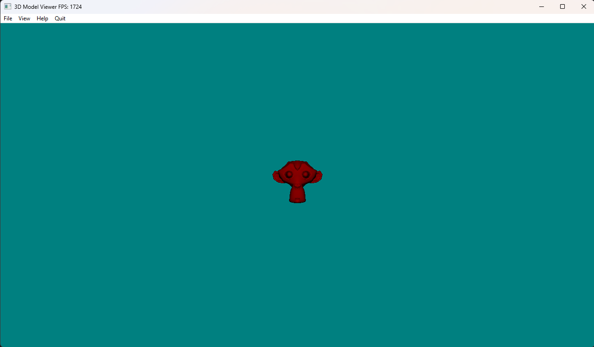
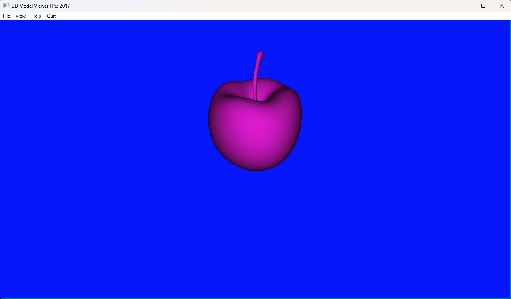
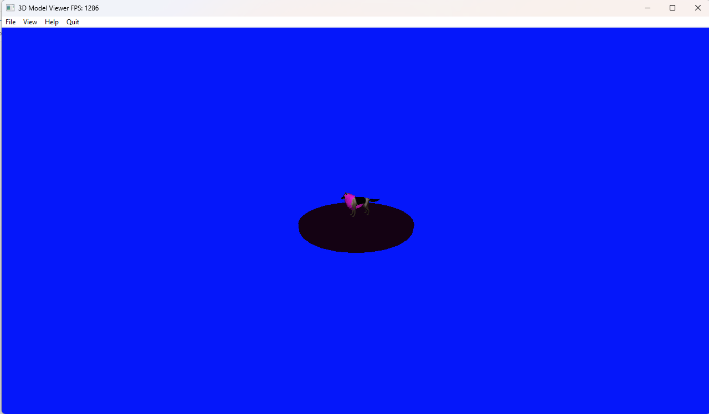

# Description

This is a project that I made in 2024 as part of my A-Level coursework.

This only works for windows as it uses Win32 API code that I havent wrapped to implement linux specific implementations
I will not be developing a linux implementation (at the moment) as this project is far too old and would require a big refactor

The project uses OpenGL as the renderer API, is built in C++ and supports 40+ different types of model file formats thanks to assimp

# Build Instructions

## Windows

Run the following commands

'''
git clone https://github.com/alonsopuente1/3D-Model-Viewer.git
cd 3D-Model-Viewer
make -j
'''

Then the executable will be compiled into the root directory, the 'build' directory only contains the intermediate object files compiler produces

# Usage

For help using the program, there is a 'Help' menu item at the top of the window. 
Load any model file you like, and if there are textures for the model file as well, the program will attempt to load them and use them.
Currently, only diffuse textures are supported. Normal map textures, specular textures etc. are not supported and do not have an effect on the rendered output

# Screenshots

